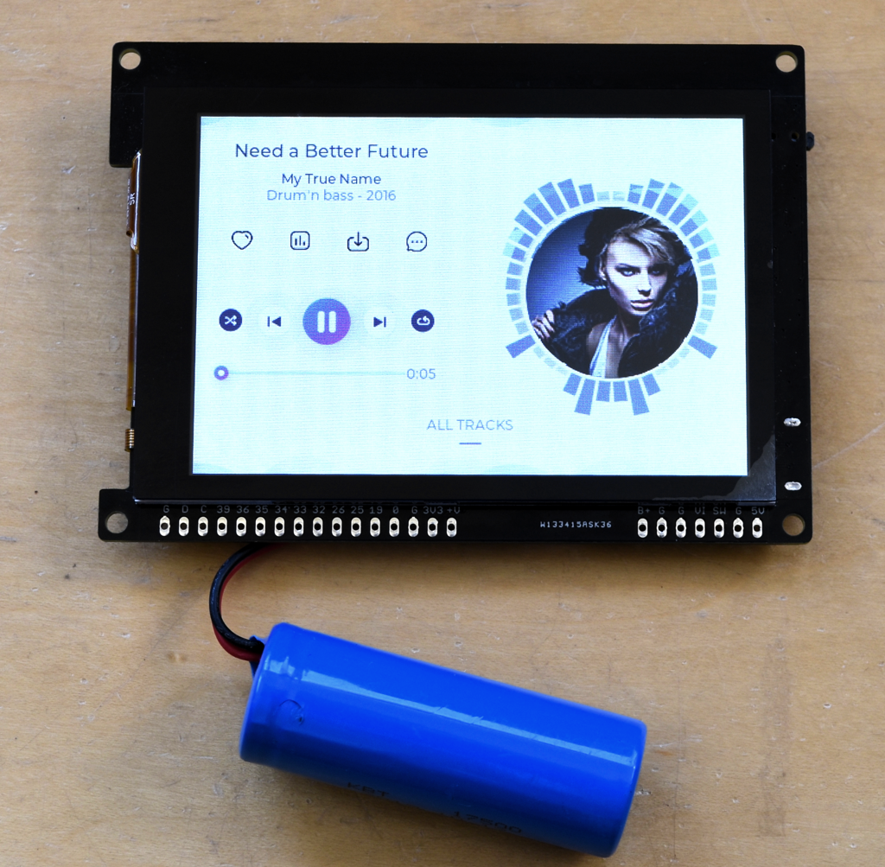

## LVGL Music Demo ported to gCore
This project is a port of the LVGL Music Player demo [music](https://github.com/lvgl/lvgl/tree/master/demos/music) to gCore using LVGL v9.0.0 and the Espressif IDF v4.2.2.  It's useful to show how to incorporate gCore display and touch drivers into a v9 project.



### Configure and Build
ESP32 related configuration items are available through the ```menuconfig```.  LVGL related configuration items are available in the ```lvgl/lv_conf.h``` file.

To build

```
idf.py build
```

Or to build and load

```
idf.py -p [SERIAL_PORT] flash
```

### Precompiled binaries
Load the precompiled binary and supporting bootloader and partition table files at the following locations in ESP32 flash memory.

| Location | File |
| --- | --- |
| 0x1000 | bootloader.bin |
| 0x8000 | partition-table.bin |
| 0x10000 | lvgl\_music_player.bin |

If you have the Espressif IDF loaded you can use its tools to download the binaries.  Assuming all three files are in the current directory and you have sourced the ```esp-idf/export.sh``` file.

```
esptool.py esp32 -p [SERIAL_PORT] -b 460800 --before default_reset --after hard_reset --chip esp32  write_flash --flash_mode dio --flash_size detect --flash_freq 80m 0x1000 bootloader.bin 0x8000 partition-table.bin 0xd000 0x10000 lvgl_music_player.bin
```

You can also use the Espressif Windows based download utility to program gCore with the files.